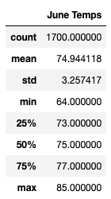
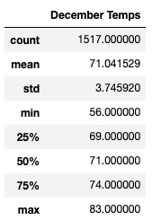

# Surfs Up: Weather Analysis

## Overview

The purpose of this analysis is to help W.Avy gain information about temperature trends before he opens his surf shop. He wants data from the months of June and December in order to see if a surf/ice cream shop would be sustainable to have open year-round. In order to perform this analysis, sqlalchemy was used to import the dataset and then transformed into a DataFrame using Python Pandas to obtain summary statistics for each month. 

## Results

### June

- The average temperature was about 75 degrees
- The coldest temperature was 64 degrees while the hottest temperature was 85 degrees

### December

- The average temperature was about 71 degrees
- The coldest temperature was 56 degrees while the hottest temperature was 83 degrees

### Comparison

- Generally speaking, the differences in summary statistics between the two months were minimal
- June, as expected, has slightly higher average, max and min temperatures 
- December temperatures have a higher variance than June temperatures

## Summary

Given the summary statistics, it would be appropriate to have a surf and ice cream shop operate year round. Although it does get slightly colder in December, the weather should support either activity as we still see temperature in the 70s and even the low 80s in the winter time. 

### Additional Inquiries

To enhance this analysis, one other variable we could filter for is precipitation. We could simply do this by replacing 'Measurements.tobs' with 'Measurement.prcp' when performing the query. 

This analysis can also be performed for other months of the year. Gathering data in fall and spring months could either help solidify the decision to open a year round surf and ice cream shop or could reveal unexpected weather trends. For instance, months like April or May could be rainier months which would qualify to be taken into consideration for year-round operations. 
